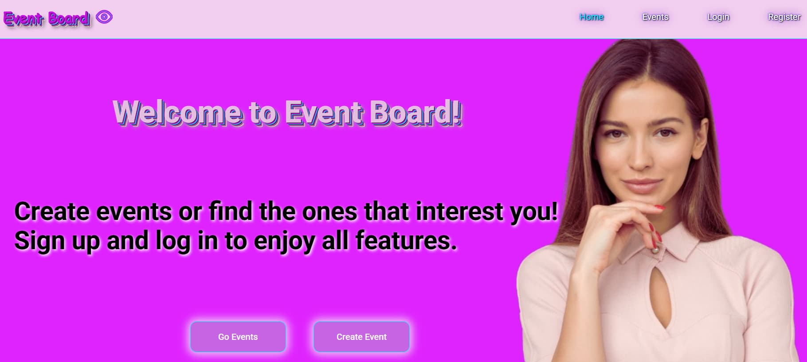

# Events Board

Events Board is an application for event organizers and users who wish to sign
up for events that interest them.

---

<p>
  
  
</p>
    
#### The application has the following pages for the convenience of both organizers and participants:

1. Login Page
2. Registration Page
3. Event Registration Page
4. Home Page
5. Events Page
6. Participants Page
7. Private Route contains a page with selected events
8. Event Creation Form for organizers
9. "Not Found" Page

---

### Technologies and tools used:

- Vite
- React-Redux
- React-router
- Firebase
- Vercel for deployment

---

### The application has the following functionalities:

- Registration, login, and logout
- Event registration
- Adding events to favorites
- Creating and deleting events

---

### Installation for developers looking to run the project locally:

```bash
git clone <github-code-url>
cd learn-easy
npm install
```
